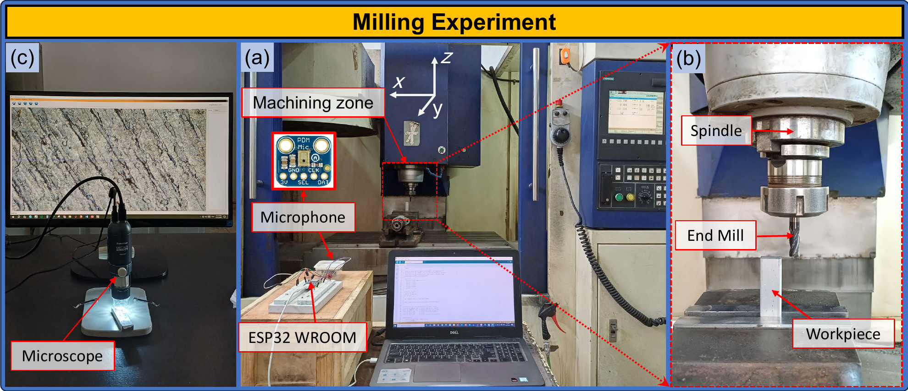

# MRDS: Meta-Rényi Distributional Sampling for Recording-Level Chatter Monitoring

> **Public data, source code, saved results, and reproducibility materials associated with the MRDS study.**

This repository accompanies the research on **Meta-Rényi Distributional Sampling (MRDS)** for reducing the number of complete machining recordings required for chatter-monitoring model development while preserving the distributional diversity of the training set.

The repository is intentionally **journal-independent** and contains only material needed for scientific review, reproducibility, and reuse.

---

## Experimental setup

<p align="center">
  
</p>

<p align="center"><em>Experimental setup for end milling and acoustic signal acquisition.</em></p>

Only the experimental-equipment/setup image is displayed in this README. Other manuscript/result figures, when retained for reproducibility, are stored under `results/` and are not displayed here.

---

## Study at a glance

- **160 complete experimental recordings**
- **40 machining conditions**
- **4 repetitions per condition**
- **40 window-level descriptors**
- complete recordings represented as empirical distributions of local descriptors
- **8 weighted support atoms** per recording distribution
- finite Rényi objective with **α = 2**
- recording-retention study from **10% to 50%**
- **20 condition-disjoint outer folds** from five seeds × four folds
- each outer split contains **120 training recordings / 40 test recordings**
- machining-condition overlap between training and test is **zero**
- downstream classifier: **unweighted Gaussian Naive Bayes**
- Rényi mixture weights are used for subset construction/refinement and are **not passed as classifier sample weights**

---

## Repository structure

```text
MRDS-Chatter-Monitoring/
├── README.md
├── CITATION.cff
├── DATA_AND_CODE_AVAILABILITY.md
├── REPRODUCIBILITY.md
├── PUBLIC_RELEASE_NOTES.md
├── SHA256SUMS.txt
├── requirements.txt
│
├── assets/
│   ├── experimental_setup.png
│   └── experimental_setup_source.pdf
│
├── chatterData/
│   └── *.mat
│
├── code/
│   ├── meta_renyi_reduction.py
│   ├── mrds_projection_refinement_integrated.py
│   ├── requirements.txt
│   └── feature_extraction/
│       └── extract_features_two_lables_okkk_V3_new_sensor40.m
│
├── experiments/
│   ├── grouped_protocol.py
│   ├── run_chatter.py
│   ├── run_chatter_audited.py
│   ├── run_chatter_grouped.py
│   ├── validate_grouped_results.py
│   ├── run_budget_curve_grouped.py
│   ├── make_grouped_renyi_refinement_figure.py
│   └── make_grouped_budget_assets.py
│
└── results/
    ├── grouped_chatter_all40/
    ├── grouped_budget_curve_all40/
    ├── figures/
    ├── tables/
    └── manuscript_assets/
```

---

## Data

The direct computational inputs used by the Python evaluation pipeline are the **160 MAT files** in `chatterData/`.

Each MAT archive contains the window-level descriptor representation used by the MRDS experiments. The accompanying manifest and feature-field files are retained under `results/grouped_chatter_all40/` so that filenames, machining-condition grouping, labels, hashes, number of windows, and the 40-feature representation can be audited.

### Important data-scope note

The current research package contains the MAT archives used by the reported computational experiments. The complete original WAV corpus from which these MAT feature archives were created is **not included** in this public package. Therefore:

- the MRDS selection/classification experiments can be rerun from the provided MAT files;
- the MATLAB feature-extraction source is provided for methodological transparency;
- complete end-to-end regeneration of all 160 MAT files from raw acoustic WAV signals is not possible from this repository alone.

This distinction is stated explicitly to avoid overstating the level of raw-data reproducibility.

---

## Feature representation

The primary archive contains **40 descriptors**:

`Avg_amp`, `CE`, `Centre_Freq`, `Clear_fact`, `CoV`, `CrestFact`, `EnR`, `Freq_Var`, `Imp_Fact`, `Kurt_fact`, `Kurtosis`, `MPE`, `Mean`, `Mean_Square_Freq`, `Mean_of_freq`, `Median`, `Median_Freq`, `OSAF`, `PTP`, `Peak`, `Peak_Freq_Ratio`, `RMS`, `RMS_freq`, `STD`, `STDF`, `Shape_Fact`, `Skew_fact`, `Skewness`, `Spectral_Energy`, `Spectral_Entropy`, `Spectral_Flatness`, `Spectral_Rolloff`, `Spectral_bandwidth`, `Spectral_centroid`, `Square_root_amp`, `TDE`, `Var`, `WPEE`, `ZeroCrossingRate`, and `wRCMDE`.

The evaluation code summarizes each complete recording with five recording-level statistics per descriptor (mean, standard deviation, 25th percentile, median, and 75th percentile), giving a **200-dimensional downstream recording representation**.

---

## MRDS implementation

The principal implementation is in:

```text
code/meta_renyi_reduction.py
code/mrds_projection_refinement_integrated.py
```

The implementation includes:

1. robust training-fitted scaling;
2. K-means compression of each recording distribution;
3. pairwise exact Earth Mover's Distance / Wasserstein computation;
4. finite meta-distribution construction;
5. Rényi-guided synthetic distribution-valued prototype optimization;
6. duplicate-free one-to-one projection onto observed recordings;
7. mixture-weight optimization;
8. one best-improvement observed-subset swap;
9. comparison with Wasserstein k-medoids, facility-location, and random-selection baselines.

The final observed subset contains distinct **complete experimental recordings**.

---

## Condition-disjoint evaluation

The primary grouped experiment is:

```bash
python experiments/run_chatter_grouped.py
```

Default archived configuration:

```text
Seeds:                  11, 23, 37, 53, 71
Folds per seed:         4
Total outer folds:      20
Primary retention:      10%
Feature set:            all 40 descriptors
Alpha:                  2.0
Max support atoms:      8
Synthetic iterations:   1
Weight iterations:      10
Refinement passes:      1
Primary metric:         Balanced Accuracy
Classifier:             GaussianNB
```

The grouping unit is the machining condition after removing only the repetition suffix `_R1`–`_R4`. Repetitions belonging to the same machining condition therefore remain together within an outer split.

The saved validation report confirms **zero machining-condition overlap** between the training and held-out test partitions.

---

## Retention study: 10–50%

The fixed retention curve is generated by:

```bash
python experiments/run_budget_curve_grouped.py
```

It reuses the frozen outer folds saved from the primary grouped experiment and evaluates:

```text
10%, 20%, 30%, 40%, and 50%
```

of the training recordings.

The archived comparison includes:

- MRDS-IS-R
- Wasserstein k-medoids + identical refinement
- Facility Location + identical refinement

Fold-wise scores, aggregate scores, selected recordings, and paired Wilcoxon/Holm comparisons are included in:

```text
results/grouped_budget_curve_all40/
```

---

## Saved results supporting the manuscript

### Primary 10% analysis

`results/grouped_chatter_all40/` contains:

- `classification.csv`
- `representativeness.csv`
- `selected_recording_ids.csv`
- `stagewise_objectives.csv`
- `folds_grouped.csv`
- `dataset_manifest_grouped.csv`
- `feature_fields.json`
- `split_summary.csv`
- `validation_report.json`
- `run_metadata.json`

### Retention analysis

`results/grouped_budget_curve_all40/` contains:

- `outer_test_scores.csv`
- `aggregate_scores.csv`
- `paired_comparisons.csv`
- `selected_recordings.csv`
- `run_metadata.json`

Derived manuscript assets are also included under `results/figures/` and `results/tables/`.

---

## Reproducing the study

### 1. Create an environment

Python 3.10+ is recommended.

```bash
python -m venv .venv
```

Windows:

```bash
.venv\Scripts\activate
```

Linux/macOS:

```bash
source .venv/bin/activate
```

Install dependencies:

```bash
pip install -r requirements.txt
```

### 2. Re-run the primary grouped analysis

To avoid overwriting archived results:

```bash
python experiments/run_chatter_grouped.py --input chatterData --output results/reproduction_primary
```

### 3. Re-run the 10–50% retention experiment

```bash
python experiments/run_budget_curve_grouped.py --input chatterData --outer-folds results/grouped_chatter_all40/folds_grouped.csv --output results/reproduction_budget
```

See [`REPRODUCIBILITY.md`](REPRODUCIBILITY.md) for provenance notes and known limitations.

---

## Reproducibility and provenance

The public package separates:

- direct computational inputs (`chatterData/*.mat`);
- source code used by the reported grouped analyses;
- saved numerical outputs supporting reported values;
- derived manuscript assets;
- experimental setup documentation.

Three provenance limitations are documented rather than hidden:

1. the currently archived `run_chatter_grouped.py` was modified after the historical 10% output was first generated, so the exact historical executed script is not available as a byte-identical snapshot;
2. the generator for `grouped_chatter_primary.tex` is not preserved, although its reported values match the archived raw CSV outputs;
3. editable-generation provenance is incomplete for some non-core manuscript figures, although the final figure assets are preserved.

---

## Code and data availability

A manuscript-ready statement is provided in [`DATA_AND_CODE_AVAILABILITY.md`](DATA_AND_CODE_AVAILABILITY.md).

After the public GitHub repository is created, replace the placeholder URL and create a tagged release corresponding to the submitted manuscript. A DOI-bearing archival snapshot is recommended for the final scholarly citation.

---

## Citation

Citation metadata are provided in [`CITATION.cff`](CITATION.cff).

Before public release, replace the author and repository placeholders. After article publication, add the article DOI under `preferred-citation`.

---

## License

No code/data license is imposed automatically by this builder. The authors should select licenses compatible with institutional and co-author requirements before publication.

---

## Integrity

`SHA256SUMS.txt` is generated automatically and can be used to verify that public files have not changed after release.

---

## Repository name

**`MRDS-Chatter-Monitoring`**

Suggested GitHub description:

> Data, source code, saved results, and reproducibility materials for Meta-Rényi Distributional Sampling (MRDS) in recording-level machine-tool chatter monitoring.
